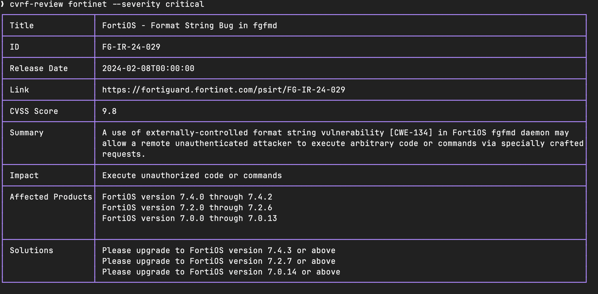

# cvrf-review

[](https://github.com/jakewarren/cvrf-review/blob/master/LICENSE)
[](https://goreportcard.com/report/github.com/jakewarren/cvrf-review)
[](http://makeapullrequest.com)


A command line utility for parsing vendor bulletins in CVRF format. 

Currently there is only a Fortinet module that processes Fortinet's RSS feed for new advisories and allows the user to filter by CVSS score and/or product types to display vulnerabilities of interest or check whether specific product versions are affected.


## Install

```
go install github.com/jakewarren/cvrf-review@latest
```


## Usage

```
❯ cvrf-review -h
Review CVRF formmated vulnerability data

Usage:
  cvrf-review [flags]
  cvrf-review [command]

Available Commands:
  completion  Generate the autocompletion script for the specified shell
  fortinet    Get Fortinet vulnerabilities
  help        Help about any command

Flags:
      --disable-border         Disable the table border
  -h, --help                   Print usage
      --json                   Print output in JSON format
      --max-cvss-score float   Filter vulnerabilities by a maximum CVSS score (default 10)
      --min-cvss-score float   Filter vulnerabilities by a minimum CVSS score
  -s, --severity string        Filter vulnerabilities by severity (critical, high, medium, low)

Use "cvrf-review [command] --help" for more information about a command.
```

### Examples:

#### Get critical Fortinet vulnerabilities:


#### List vulnerabilities for a specific product version
```bash
cvrf-review fortinet affected --product FortiOS --version 6.4.10
```

## Web Interface

A WebAssembly-based front end is available for browsing CVRF data in a browser. The GitHub Pages workflow builds the WASM binary automatically. For local testing, copy the runtime stub and build the module, then open `index.html` from a static file server.

```bash
cp "$(go env GOROOT)"/misc/wasm/wasm_exec.js .
GOOS=js GOARCH=wasm go build -o main.wasm ./wasm
# Serve from the repo root so index.html can fetch cvrf/ and main.wasm
python3 -m http.server 8000
# Open http://localhost:8000/
```

When served from the repository root the page can access the CVRF files from the `cvrf/` directory.
The list of available advisories is maintained in `cvrf/manifest.json`, which is regenerated by a GitHub Actions workflow.


## Acknowledgments
Inspired by [MaineK00n/vuls-data-update](https://github.com/MaineK00n/vuls-data-update).

